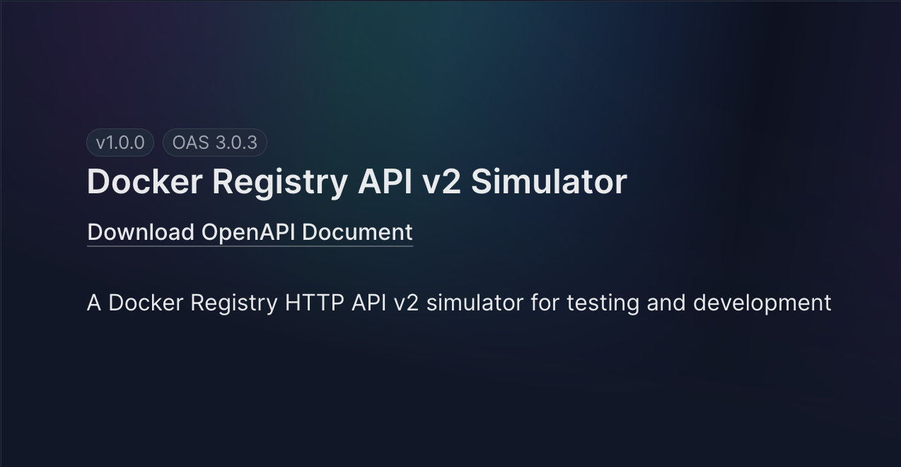

# Docker Registry API v2 Simulator

A Docker Registry HTTP API v2 simulator built with Bun, ElysiaJS, and lowdb. Implements the read-only subset of the Docker Registry spec for testing and development.



## What it does ?

- Docker Registry API v2 spec-compliant
- Multi-configuration support via environment variable
- Repository catalog with pagination (RFC5988 Link headers)
- Tag listing with pagination
- Manifest retrieval:
  - Single-arch: OCI + Docker v2 manifests
  - Multi-arch: OCI image index + Docker manifest list
- ETag and If-None-Match support (304 responses)
- Blob retrieval (config blobs only)
- Basic authentication support
- Swagger UI documentation
- Test simulation using Hurl

## Prerequisites

- [Bun](https://bun.sh) v1.0+
- [Hurl](https://hurl.dev) (for tests)
- Docker/Podman (optional)

## Installation

```bash
bun install
```

## Build

Build the JavaScript bundle (for npm/bunx distribution):

```bash
bun run build
```

This creates a minified executable JavaScript file at `dist/index.js` (~1.2MB) that requires Bun to run.


## Docker

The Containerfile uses a multi-stage build to create an optimized ~100MB image.

Build and run with Docker Compose:

```bash
docker compose up -d
```

Three instances will start:
- registry-full (port 5001) - 4 repositories (data/db-full.json)
- registry-minimal (port 5002) - 1 repository (data/db-minimal.json)
- registry-custom (port 5003) - customizable (data/db-custom.json)

Or build a single image:

```bash
docker build -f Containerfile -t registry-simulator .
docker run -p 5001:5001 -v ./data/db.json:/data/db.json:ro registry-simulator
```

## Usage

The simulator provides three commands:

### Start the server

```bash
bun run serve                           # uses data/db.json on port 5001
bun run serve -f data/db-full.json      # use specific database
bun run serve -p 3000                   # use custom port
bun run serve -f data/db-custom.json -p 3000  # both options
```

Server runs on http://localhost:5001 by default.

Endpoints:
- Health: http://localhost:5001/v2/
- Swagger: http://localhost:5001/swagger

### Generate a database from template

```bash
bun run generate templates/example.yaml    # generates from YAML template
bun run generate templates/example.jsonc   # or from JSONC template
```

The generated database will be saved in the `data/` directory with a unique UUID filename.

### Validate a database file

```bash
bun run validate data/db.json              # validate database structure
bun run validate data/db-custom.json       # validate any database file
```

### Run tests

```bash
hurl --test tests/*.hurl
```

## API Endpoints

```
GET  /v2/                          # Health check
GET  /v2/_catalog                  # List repositories (supports ?n=10&last=alpine)
GET  /v2/:name/tags/list           # List tags (supports ?n=5&last=v1.0)
GET  /v2/:name/manifests/:ref      # Get manifest (supports Accept header, If-None-Match)
HEAD /v2/:name/manifests/:ref      # Manifest headers
GET  /v2/:name/blobs/:digest       # Get blob (config only)
HEAD /v2/:name/blobs/:digest       # Blob headers
```

## Configuration

The simulator uses JSON files for data stored in the `data/` directory. Use the `-f` flag to specify which database to use.

Available datasets:
- `data/db.json` - 4 repositories (alpine, nginx, redis, postgres) with auth enabled (default)
- `data/db-minimal.json` - 1 repository (alpine) with auth disabled
- `data/db-full.json` - Full example with multiple repositories
- `data/db-custom.json` - Examples of:
  - Untagged repository (`untagged-repo`)
  - Single-arch manifest (`single-arch`)
  - Multi-arch manifest (`multi-arch` with amd64 and arm64)
  - Auth disabled

Create custom datasets by:
1. Using the `generate` command with a YAML/JSONC template
2. Copying and modifying existing database files

### Authentication

Basic authentication is supported. Add users to the `auth` array in your JSON configuration:

```json
{
  "auth": [
    { "username": "admin", "password": "admin123" },
    { "username": "user", "password": "user123" }
  ]
}
```

If `auth` is an empty array `[]`, authentication is disabled. The `/v2/` health endpoint is always accessible without authentication.

## Examples

```bash
# Health check (no auth required)
curl http://localhost:5001/v2/

# List repositories (with auth)
curl -u admin:admin123 http://localhost:5001/v2/_catalog

# List tags (with auth)
curl -u admin:admin123 http://localhost:5001/v2/alpine/tags/list

# Get manifest with auth (Docker v2)
curl -u admin:admin123 \
  -H "Accept: application/vnd.docker.distribution.manifest.v2+json" \
  http://localhost:5001/v2/alpine/manifests/latest

# Get manifest with auth (OCI)
curl -u admin:admin123 \
  -H "Accept: application/vnd.oci.image.manifest.v1+json" \
  http://localhost:5001/v2/alpine/manifests/latest

# Test ETag with auth (returns 304)
ETAG=$(curl -u admin:admin123 -sI http://localhost:5001/v2/alpine/manifests/latest | grep -i etag | cut -d' ' -f2)
curl -u admin:admin123 -H "If-None-Match: $ETAG" http://localhost:5001/v2/alpine/manifests/latest

# Without auth (returns 401 if auth is enabled)
curl http://localhost:5001/v2/_catalog

# Multi-arch manifest list (Docker)
curl -H "Accept: application/vnd.docker.distribution.manifest.list.v2+json" \
  http://localhost:5001/v2/multi-arch/manifests/latest

# Multi-arch OCI index
curl -H "Accept: application/vnd.oci.image.index.v1+json" \
  http://localhost:5001/v2/multi-arch/manifests/latest
```

## Tech Stack

- Bun - JavaScript runtime
- ElysiaJS - Web framework
- lowdb - JSON database
- Hurl - HTTP testing

## License

MIT - See [LICENSE](LICENSE) file for details.
